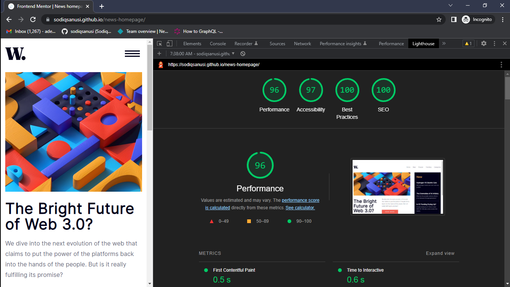

# Frontend Mentor - News homepage solution

This is a solution to the [News homepage challenge on Frontend Mentor](https://www.frontendmentor.io/challenges/news-homepage-H6SWTa1MFl). Frontend Mentor challenges help you improve your coding skills by building realistic projects. 

## Table of contents

- [Overview](#overview)
  - [The challenge](#the-challenge)
  - [Screenshot](#screenshot)
  - [Links](#links)
- [My process](#my-process)
  - [Built with](#built-with)
  - [What I learned](#what-i-learned)
  - [Continued development](#continued-development)
  - [Useful resources](#useful-resources)
- [Author](#author)
- [Acknowledgments](#acknowledgments)

## Overview

This was a quite simple and basic design. Decided to try some new things out though, like implementing local fonts instead of using Google Fonts (*which I've used for almost all interfaces I built.*)

### The challenge

Users should be able to:

- View the optimal layout for the interface depending on their device's screen size
- See hover and focus states for all interactive elements on the page

### Screenshot

### Links

- Solution URL: [https://github.com/sodiqsanusi/news-homepage](https://github.com/sodiqsanusi/news-homepage)
- Live Site URL: [https://sodiqsanusi.github.io/news-homepage/](https://sodiqsanusi.github.io/news-homepage/)

## My process
As usual, almost same workflow with slight differentiations:
1. Sketched out the HTML structure & a rough overview of the site on paper.
2. Wrote the HTML code following the rough sketch (*had to make some slight changes with the semantics later on sha*).
3. Started styling for mobile/small screen devices.
4. Worked on the mobile navigation panel, that was the only part of the site that needed some functionality actually.
5. Made the site responsive for large screen devices.
6. Used Lighthouse tool to check for possible improvements, then tweaked things using the gotten feedback.

### Built with

- Semantic HTML5 markup
- CSS custom properties
- Flexbox
- Mobile-first workflow

### What I learned

Might have said it earlier, but this was the first time I used self-hosted fonts on a project. It was surprisingly not difficult, will put up the links that particularly helped me in getting this to work below.

### Continued development

- Getting more complex, and difficult designs to replicate.
- Building or being part of a team creating a live product.
- Will try reaching out to some companies for an internship, not just sure if they'll want to take a chance with a freshman undergrad, understandable if they don't actually.

### Useful resources

- [The Easy Way to Add Fonts to Your Website (Including Custom Fonts) - Pagecloud](https://www.pagecloud.com/blog/how-to-add-custom-fonts-to-any-website) - This was very helpful, especially the "Webfont Generator" tool they shared in the article. Solid resource to use if you're new to using custom fonts and all.

## Author

- Frontend Mentor - [@sodiqsanusi](https://www.frontendmentor.io/profile/sodiqsanusi)
- Twitter - [@sodiqsanusi_](https://www.twitter.com/sodiqsanusi_)

## Acknowledgments

For calling you at odd hours, ranting about how I feel stunted in my development journey, 🤍.